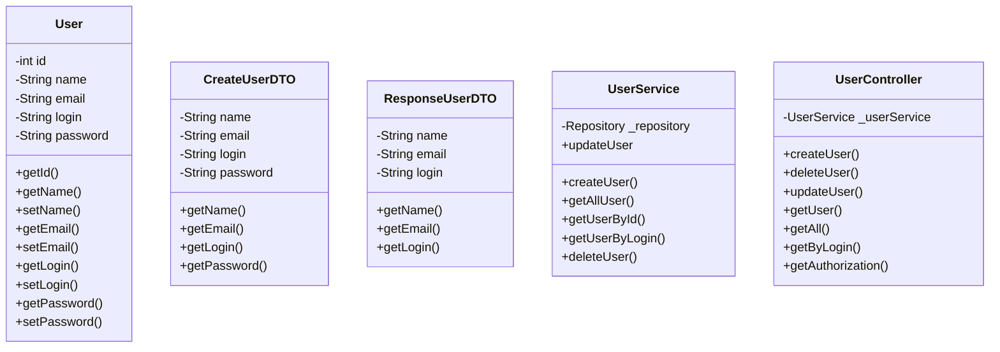

```mermaid
classDiagram
    class User{
        -int id
        -String name
        -String email
        -String login
        -String password

        +getId()
        +getName()
        +setName()
        +getEmail()
        +setEmail()
        +getLogin()
        +setLogin()
        +getPassword()
        +setPassword()
    }
    class CreateUserDTO{
        -String name
        -String email
        -String login
        -String password

        +getName()
        +getEmail()
        +getLogin()
        +getPassword()
    }

    class ResponseUserDTO{
        -String name
        -String email
        -String login

        +getName()
        +getEmail()
        +getLogin()
    }

    class UserService{
        -Repository _repository
        +createUser()
        +getAllUser()
        +getUserById()
        +getUserByLogin()
        +updateUser
        +deleteUser()
    }

    class UserController{
        -UserService _userService
        +createUser()
        +deleteUser()
        +updateUser()
        +getUser()
        +getAll()
        +getByLogin()
        +getAuthorization()
    }

```